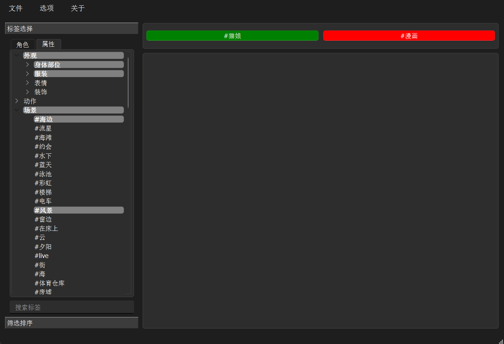
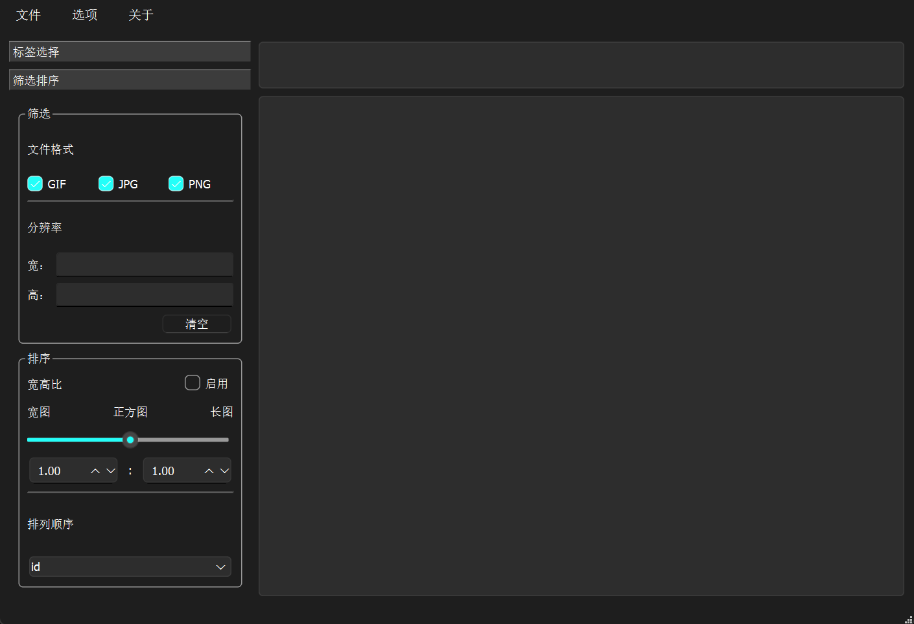

# pixiv_pictures_manager

[English](EN_README.md) | [简体中文](README.md)

This is a prototype of my other project [Waifu Gallery](https://github.com/R4nd5tr/waifu_gallery), which has been discontinued. Waifu Gallery has more features and better performance.

Have you downloaded a bunch of pictures from pixiv but can't find the ones you want due to the sheer volume? This tool can help you manage these pictures, making it easier to find and use them.

Only supports pictures downloaded using [Powerful Pixiv Downloader](https://github.com/xuejianxianzun/PixivBatchDownloader).

## Table of Contents
- [pixiv\_pictures\_manager](#pixiv_pictures_manager)
  - [Table of Contents](#table-of-contents)
  - [Project Background](#project-background)
  - [Features](#features)
    - [1. Tag Search](#1-tag-search)
    - [2. Tag Completion](#2-tag-completion)
    - [3. Picture Filtering](#3-picture-filtering)
    - [4. Picture Sorting](#4-picture-sorting)
  - [Usage](#usage)
    - [Environment Requirements](#environment-requirements)
    - [Installation Steps](#installation-steps)
    - [Usage Tutorial](#usage-tutorial)
      - [1. Scan Your Picture Folder](#1-scan-your-picture-folder)
      - [2. Use Tag Search](#2-use-tag-search)
      - [3. Filter Pictures](#3-filter-pictures)
      - [4. Sort Pictures](#4-sort-pictures)
  - [Future Plans](#future-plans)
  - [User Feedback](#user-feedback)
  - [Changelog](#changelog)
  - [License](#license)
  - [Related Links](#related-links)

## Project Background
After downloading a large number of pictures from Pixiv, managing and finding specific pictures becomes very difficult. This tool aims to help users quickly find desired pictures through tags, filtering, and sorting features to improve picture management efficiency.

## Features
### 1. Tag Search
- Search pictures using tags with multi-tag support.
### 2. Tag Completion
- Automatically complete picture tags based on existing tags and tag relationships in the tag library.
### 3. Picture Filtering
- Filter pictures by file type or resolution.
### 4. Picture Sorting
- Sort pictures by file size, resolution, aspect ratio, and other attributes.

## Usage

### Environment Requirements
- Python 3.9+ (Developed on Python 3.11.10)
- Dependencies listed in `requirements.txt`

### Installation Steps
1. Clone repository:
```shell
git clone https://github.com/djasoid/pixiv_pictures_manager.git
```
2. Enter directory:
```shell
cd pixiv_pictures_manager
```
3. Install dependencies:
```shell
pip install -r requirements.txt
```
4. Run the program:
```shell
python src/start_picture_manager.py
```

### Usage Tutorial
#### 1. Scan Your Picture Folder
Click `File` → `Add New Pictures` and select your folder. The program will:
- Auto-detect PID and image numbers in filenames (supports `{pid}_{num}.ext` and `{pid}.ext` formats)
- Parse metadata files (`.txt`/`.csv`) from Powerful Pixiv Downloader
- Complete tags using the tag library

#### 2. Use Tag Search

- Click sidebar tags to include (green)
- Double-click tags to exclude (red)
- Multi-tag search supported
- Shows untagged pictures when no tags selected

#### 3. Filter Pictures

- Filter by file type (JPG/PNG/GIF)
- Resolution filtering:
  - `<1000`: Width/Height < 1000px
  - `>1000`: Width/Height > 1000px 
  - `1000-2000`: Between 1000px-2000px

#### 4. Sort Pictures
- Sort by aspect ratio (closest matches first)
- Sort by PID
- More sorting options in development

## License
GPLv3 - See [LICENSE](LICENSE)

## Related Links
- [Powerful Pixiv Downloader](https://github.com/xuejianxianzun/PixivBatchDownloader)